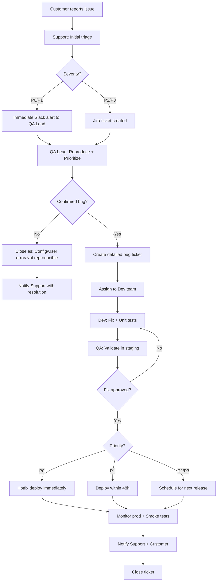

## Support → QA → Dev → Release Workflow

### Workflow Table

| Stage                    | Owner        | Actions                                                                                                                                                                                                    | Exit Criteria                                                                                              | Notifications                                                                                           |
| ------------------------ | ------------ | ---------------------------------------------------------------------------------------------------------------------------------------------------------------------------------------------------------- | ---------------------------------------------------------------------------------------------------------- | ------------------------------------------------------------------------------------------------------- |
| **1. Support Intake**    | Support      | • Customer reports issue via ticket   • Initial triage: Severity (Critical/High/Medium/Low)   • Gather: Steps to reproduce, account ID, environment   • Tag: "needs-qa-triage"                    | • Issue logged in Jira   • Basic info collected (what/when/who)                                         | • Slack: #support-escalations (P0/P1 only)   • Email: QA Lead (P0 only)                              |
| **2. QA Triage**         | QA Lead      | • Validate reproducibility (staging/prod)   • Assign priority (P0-P3)   • Classify: Bug/Feature/Config issue   • Create detailed bug ticket (if confirmed)   • Attempt workaround for customer | • Priority assigned   • Reproduction steps documented   • Logs/screenshots attached                  | • Slack: #qa-team (all bugs)   • Slack: #dev-team (P0/P1)   • Jira: Mention Support rep           |
| **3. Dev Investigation** | Dev Team     | • Root cause analysis   • Estimate fix effort (hours/days)   • Propose solution + rollback plan   • Implement fix + unit tests   • Self-test in dev environment                                | • Fix implemented   • Unit tests pass   • Code reviewed (peer review)   • Ready for QA validation | • Slack: Mention QA Lead when ready   • Jira: Status → "Ready for QA"                                |
| **4. QA Validation**     | QA Team      | • Test fix in staging (original repro steps)   • Regression testing (related flows)   • Edge case validation   • Performance check (if applicable)   • Approve or reject fix                   | • Original bug fixed ✅   • No new regressions ✅   • Automated test added ✅                           | • Slack: #qa-team (if rejected)   • Jira: Status → "Approved" or "Failed QA"                         |
| **5. Release Decision**  | QA Lead + PM | • P0: Hotfix (immediate deploy)   • P1: Next release (within 48h)   • P2/P3: Scheduled release   • Create release notes   • Notify Support with workarounds                                    | • Release approved   • Rollback plan documented   • Stakeholders notified                            | • Slack: #releases (all)   • Email: Support team (workarounds)   • Slack: Founder/Product (P0/P1) |
| **6. Post-Release**      | QA Lead      | • Monitor production (30 min - 24h)   • Smoke tests on prod   • Check Support tickets (issue resolved?)   • Update bug ticket: "Deployed"                                                         | • No regressions detected   • Customer confirms fix   • Metrics stable                               | • Slack: #releases ("Fix deployed")   • Jira: Close ticket   • Email: Customer (via Support)      |

### Workflow Diagram

### Key Principles

**When Support hands to QA:**

- **P0/P1:** Immediately via Slack (within 15 min)
- **P2/P3:** Daily digest (end of day)
- Always include: Account ID, environment, reproduction steps

**When QA pulls in Dev:**

- After confirming reproducibility (don't waste dev time on false alarms)
- With detailed bug ticket (logs, steps, expected vs actual)
- **P0:** Immediate (Slack mention)
- **P1:** Within 2 hours
- **P2/P3:** Next standup

**Before fix goes live:**

- QA approval required (test in staging)
- Automated test added (prevent regression)
- Rollback plan documented (especially P0 hotfixes)
- Smoke tests ready (run post-deploy)

**Keeping stakeholders in loop:**

**Support:** Jira updates (auto-notify), workarounds shared immediately

**Founder/Product:**

- **P0:** Immediate Slack + status updates every 2 hours until resolved
- **P1:** Daily summary ("Bug X in progress, ETA 48h")
- **P2/P3:** Weekly bug summary

**Customers (via Support):**

- Workaround provided within 4 hours (if available)
- Fix ETA shared ("We expect this fixed by [date]")
- Follow-up when deployed ("This issue is now resolved")
